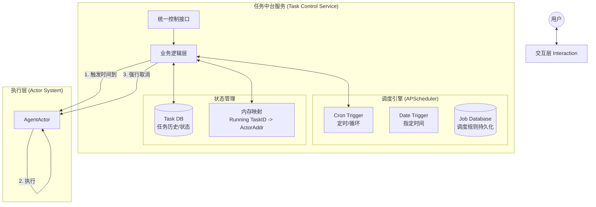

# 任务中台服务 (Task Control Service)

## 1. 设计理念

### 核心设计原则
- **定义与实例分离**：
  - **任务定义 (Task Definition)**：规则，如"每天早上8点发日报"，由调度器管理
  - **任务实例 (Task Instance)**：执行，如"2023年10月1日 08:00 的那一次发送"，由Actor系统管理

- **全生命周期管理**：
  - 调度生命周期：由TaskControlService + JobStore管理（持久化，负责何时触发）
  - 执行生命周期：由ActorSystem管理（临时，负责具体执行）

### 增强版架构图



## 2. 代码结构

```
events/
├── task_models.py          # 数据模型定义
├── task_repository.py      # 任务仓库（持久化）
├── task_control_service.py # 核心服务类（调度器+业务逻辑）
├── task_api.py             # FastAPI接口
├── task_example.py         # 使用示例
└── README.md               # 文档
```

## 3. 核心组件

### 3.1 数据模型

#### TaskTriggerType（触发类型）
- `IMMEDIATE`：立即执行
- `SCHEDULED`：指定未来某时间点执行一次
- `LOOP`：循环执行（间隔/Cron）

#### TaskStatus（任务状态）
- `ACTIVE`：调度中（针对循环任务）
- `PAUSED`：调度暂停（不触发新任务）
- `RUNNING`：实例正在运行
- `COMPLETED`：结束
- `CANCELLED`：取消

### 3.2 任务仓库 (TaskRepository)
- 负责任务定义和实例的持久化管理
- 使用SQLite数据库存储
- 提供完整的CRUD操作

### 3.3 任务控制服务 (TaskControlService)
- 基于APScheduler实现的全功能任务调度服务
- 支持三种触发模式：立即、定时、循环
- 提供任务的创建、暂停、恢复、取消、手动触发等功能
- 单例模式设计，全局唯一实例

## 4. 使用方法

### 4.1 基本使用

```python
from events.task_control_service import task_control_service
from events.task_models import TaskTriggerType

# 创建立即执行的任务
task_def_id = task_control_service.create_task(
    user_id="user1",
    content="立即执行的测试任务",
    trigger_type=TaskTriggerType.IMMEDIATE
)

# 创建循环执行的任务（每30秒一次）
task_def_id = task_control_service.create_task(
    user_id="user1",
    content="循环执行的测试任务",
    trigger_type=TaskTriggerType.LOOP,
    trigger_args={"interval": 30}
)
```

### 4.2 任务操作

```python
# 暂停任务调度
task_control_service.pause_schedule(task_def_id)

# 恢复任务调度
task_control_service.resume_schedule(task_def_id)

# 手动触发一次
task_control_service.trigger_immediately(task_def_id)

# 彻底取消任务
task_control_service.cancel_task(task_def_id)
```

### 4.3 查看任务信息

```python
# 获取任务定义
task_def = task_control_service.get_task_definition(task_def_id)

# 获取任务实例列表
instances = task_control_service.get_task_instances(task_def_id)

# 获取用户的所有任务
user_tasks = task_control_service.get_user_tasks("user1")
```

## 5. API接口

### 5.1 启动API服务

```bash
python -m events.task_api
```

API服务将运行在 http://localhost:8000，可通过 http://localhost:8000/docs 访问Swagger文档

### 5.2 主要API端点

| 方法 | 路径 | 功能 |
|------|------|------|
| POST | `/tasks` | 创建任务 |
| POST | `/tasks/{task_def_id}/pause` | 暂停任务调度 |
| POST | `/tasks/{task_def_id}/resume` | 恢复任务调度 |
| POST | `/tasks/{task_def_id}/cancel` | 取消任务 |
| POST | `/tasks/{task_def_id}/trigger` | 手动触发任务 |
| GET | `/tasks/{task_def_id}` | 获取任务定义 |
| GET | `/tasks/{task_def_id}/instances` | 获取任务实例列表 |
| GET | `/users/{user_id}/tasks` | 获取用户任务列表 |

## 6. 交互示例

### 场景1：创建循环任务

**用户输入**："每隔30分钟帮我监控一下服务器状态"

**交互流程**：
1. 交互层解析意图：`Intent: CREATE_TASK, Type: LOOP, Interval: 1800s`
2. 调用中台API：
   ```python
   service.create_task(
       user_id="user1",
       content="监控服务器状态",
       trigger_type=TaskTriggerType.LOOP,
       trigger_args={"interval": 1800}
   )
   ```
3. 中台处理：
   - 写入任务定义到数据库
   - 添加调度任务到APScheduler
   - 返回 `task_def_id`

### 场景2：暂停任务

**用户输入**："先别监控了，暂停一下"

**交互流程**：
1. 交互层解析意图：`Intent: PAUSE, Target: "监控服务器"`
2. 通过模糊匹配找到对应的 `task_def_id`
3. 调用中台API：
   ```python
   service.pause_schedule(task_def_id)
   ```
4. 中台处理：
   - 调用 `scheduler.pause_job()`
   - 更新数据库状态为 `PAUSED`

### 场景3：手动触发任务

**用户输入**："现在立刻监控一次"

**交互流程**：
1. 交互层解析意图：`Intent: TRIGGER_NOW, Target: "监控服务器"`
2. 通过模糊匹配找到对应的 `task_def_id`
3. 调用中台API：
   ```python
   service.trigger_immediately(task_def_id)
   ```
4. 中台处理：
   - 绕过调度器，直接调用 `_spawn_instance`
   - 创建新的任务实例并执行

## 7. 运行示例

```bash
python -m events.task_example
```

## 8. 技术栈

- **Python 3.8+**
- **APScheduler**：任务调度引擎
- **SQLAlchemy**：ORM框架
- **SQLite**：轻量级数据库
- **FastAPI**：API框架
- **Thespian**：Actor框架
- **Pydantic**：数据验证

## 9. 总结

本任务中台服务的核心改进在于：

1. **引入专业调度器**：使用APScheduler替代临时的Actor time.sleep，让中台拥有了可靠的时间概念
2. **生命周期分离**：清晰区分了调度生命周期和执行生命周期
3. **完整的API支持**：提供了RESTful API，方便前端和其他系统调用
4. **持久化设计**：调度规则和任务历史都进行了持久化存储
5. **灵活的触发方式**：支持立即、定时、循环三种模式
6. **全面的任务控制**：支持暂停、恢复、取消、手动触发等操作

通过本服务，可以实现对任务的全生命周期管理，满足各种复杂的任务调度需求。